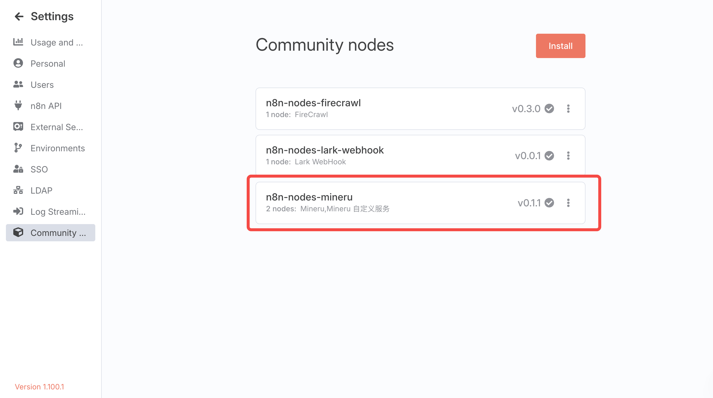
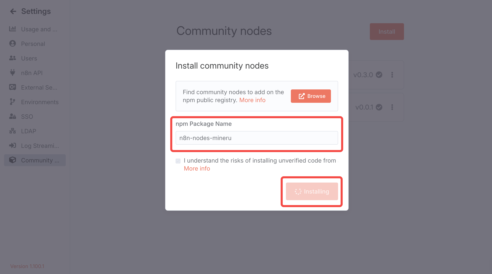
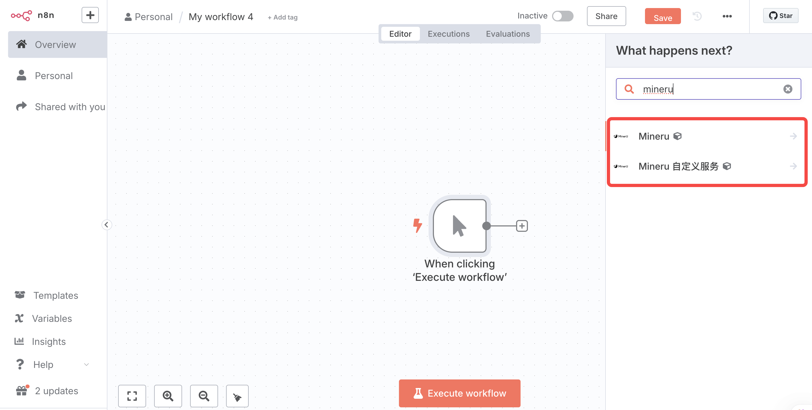
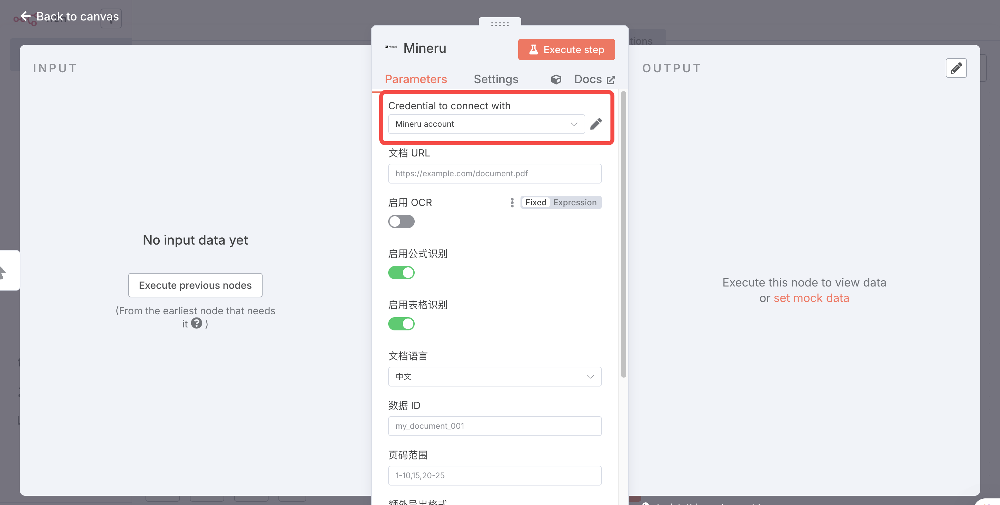
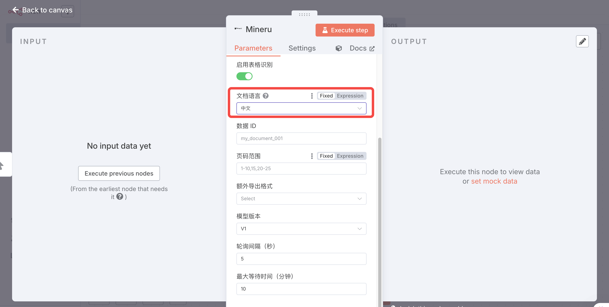
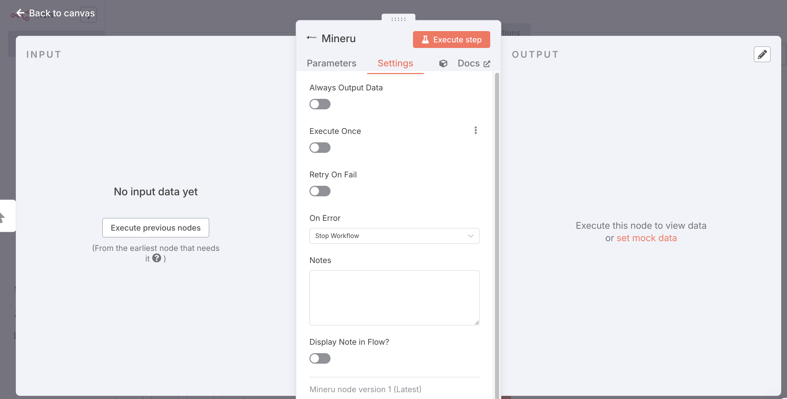
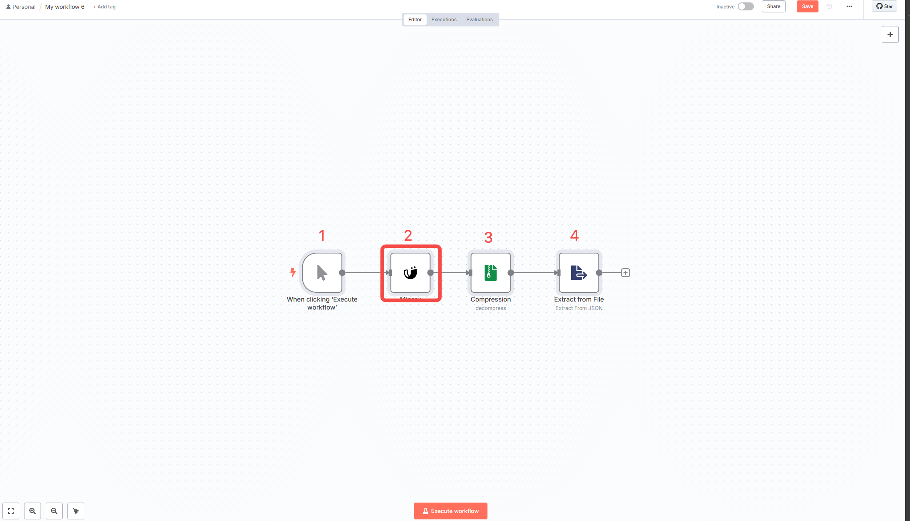
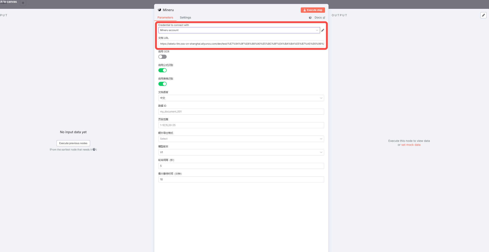
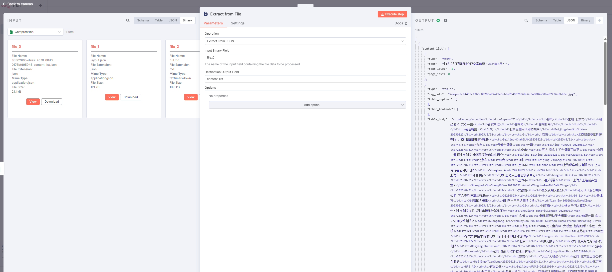
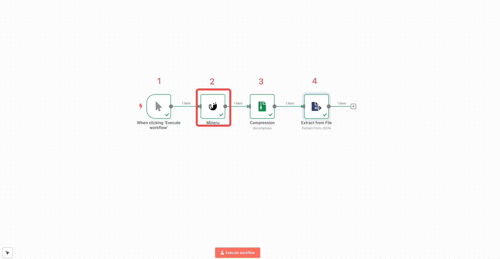

# n8n
**n8n** 是一款以低代码（Low-code）、工作流自动化为核心的应用开发平台，许多企业都借助于其灵活的节点（Node）配置，实现业务流程的自动化执行。它通过可视化界面和代码扩展能力，帮助用户连接各种应用程序和服务，构建复杂的自动化流程,降低用户使用门槛。

目前，MinerU 已将其强大的文档解析能力封装为 n8n 节点，用户在搭建工作流时，可以更加便捷地处理复杂的文档解析任务。

使用请访问：https://n8n.io/

## 进入社区node安装界面



## 安装 n8n-nodes-mineru 节点



##  新建工作流，添加 n8n-nodes-mineru 节点，并设置 api key









### n8n使用节点文档

https://www.npmjs.com/package/n8n-nodes-mineru

### **在工作流内集成解压功能**

#### 导入 json 模板

??? tip "点击查看完整的 JSON 工作流代码"

    ```json
    {
      "name": "My workflow 5",
      "nodes": [
        {
          "parameters": {},
          "type": "n8n-nodes-base.manualTrigger",
          "typeVersion": 1,
          "position": [
            680,
            -420
          ],
          "id": "86bedecc-6949-4d51-93df-4aa3283df3db",
          "name": "When clicking ‘Execute workflow’"
        },
        {
          "parameters": {
            "operation": "fromJson",
            "binaryPropertyName": "file_0",
            "destinationKey": "content_list",
            "options": {}
          },
          "type": "n8n-nodes-base.extractFromFile",
          "typeVersion": 1,
          "position": [
            1320,
            -420
          ],
          "id": "67ce0d1d-59e7-45cf-90e7-7d4c534041d6",
          "name": "Extract from File"
        },
        {
          "parameters": {},
          "type": "n8n-nodes-base.compression",
          "typeVersion": 1.1,
          "position": [
            1100,
            -420
          ],
          "id": "741bca6b-eeaa-4af1-a5ed-84827ae88cb4",
          "name": "Compression"
        },
        {
          "parameters": {
            "url": "[https://labelu-llm.oss-cn-shanghai.aliyuncs.com/dev/test/%E7%94%9F%E6%88%90%E5%BC%8F%E4%BA%BA%E5%B7%A5%E6%99%BA%E8%83%BD%E6%9C%8D%E5%8A%A1%E5%B7%B2%E5%A4%87%E6%A1%88%E4%BF%A1%E6%81%AF%EF%BC%882024%E5%B9%B44%E6%9C%88%EF%BC%89.pdf?OSSAccessKeyId=LTAI5t6bwJG7fUnEXehzAZNp&Expires=2068176370&Signature=mvNHdhnmdEVzE1kOKoBQfIwJ%2Bno%3D](https://labelu-llm.oss-cn-shanghai.aliyuncs.com/dev/test/%E7%94%9F%E6%88%90%E5%BC%8F%E4%BA%BA%E5%B7%A5%E6%99%BA%E8%83%BD%E6%9C%8D%E5%8A%A1%E5%B7%B2%E5%A4%87%E6%A1%88%E4%BF%A1%E6%81%AF%EF%BC%882024%E5%B9%B44%E6%9C%88%EF%BC%89.pdf?OSSAccessKeyId=LTAI5t6bwJG7fUnEXehzAZNp&Expires=2068176370&Signature=mvNHdhnmdEVzE1kOKoBQfIwJ%2Bno%3D)"
          },
          "type": "n8n-nodes-mineru.mineru",
          "typeVersion": 1,
          "position": [
            900,
            -420
          ],
          "id": "8ea12d28-b2c5-4836-8e2b-a534da0c7b42",
          "name": "Mineru",
          "credentials": {
            "mineruApi": {
              "id": "zbdLIur6aktm5X5U",
              "name": "Mineru account"
            }
          }
        }
      ],
      "pinData": {},
      "connections": {
        "Compression": {
          "main": [
            [
              {
                "node": "Extract from File",
                "type": "main",
                "index": 0
              }
            ]
          ]
        },
        "When clicking ‘Execute workflow’": {
          "main": [
            [
              {
                "node": "Mineru",
                "type": "main",
                "index": 0
              }
            ]
          ]
        },
        "Mineru": {
          "main": [
            [
              {
                "node": "Compression",
                "type": "main",
                "index": 0
              }
            ]
          ]
        }
      },
      "active": false,
      "settings": {
        "executionOrder": "v1"
      },
      "versionId": "290007c9-68f0-4f19-8c78-edb52ff60778",
      "meta": {
        "templateCredsSetupCompleted": true,
        "instanceId": "b99d35cfe226130f0ddbda4737036ccd732732b25ef1b8e3b88e9ff26062d5b3"
      },
      "id": "aiE6BKLoIVtOv2Cj",
      "tags": []
    }
    ```



### 配置 凭证和文档url



### 根据各自的需求配置所需的输出



### 调试

