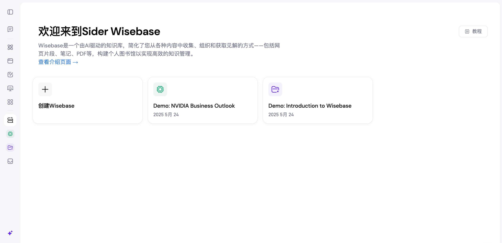

# Sider

Sider 是一款浏览器侧边栏类的 AI 助手扩展，主要在网页右侧开启一个“随处可用”的智能面板，把对话式 AI（如 GPT、Claude、Gemini 等）带到你正在浏览的任何页面中。它的核心定位是：提升阅读、写作、翻译、检索与总结效率，并与网页内容深度联动。 目前，Sider在Wisebase模块中深度集成了MinerU的相关功能。该模块是一个由AI驱动的知识库，您可以通过上传PDF等各类型文件，构建个人图书馆以实现高效的知识管理，MinerU可以帮助您更好地解析此类文件，精准地提取文件中的信息。

使用请访问：https://sider.ai/zh-CN/wisebase